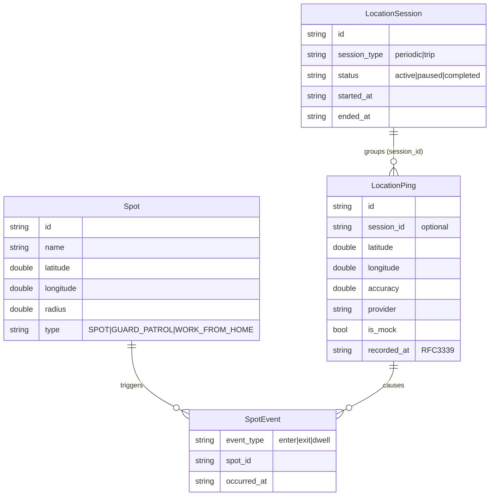

# Location Monitoring — `fio_backend_client`

> Guide to using the Location Monitoring feature (real-time GPS tracking, sessions,
> spot/checkpoint zones, and history) via the Dart client `fio_backend_client`.

---

## Table of Contents

1. [Overview](#1-overview)
2. [Data Model](#2-data-model)
3. [Overall Flow](#3-overall-flow)
4. [Prerequisites](#4-prerequisites)
5. [Setup — MobileApiClient](#5-setup--mobileapiclient)
6. [Step 1 — Submit a Single Ping](#6-step-1--submit-a-single-ping)
7. [Step 2 — Submit a Batch of Pings](#7-step-2--submit-a-batch-of-pings)
8. [Step 3 — Manage Tracking Sessions](#8-step-3--manage-tracking-sessions)
9. [Step 4 — Query Session List & Detail](#9-step-4--query-session-list--detail)
10. [Step 5 — Query Ping History](#10-step-5--query-ping-history)
11. [Step 6 — List Spots](#11-step-6--list-spots)
12. [Spot Events](#12-spot-events)
13. [Complete Example](#13-complete-example)
14. [Validation Rules](#14-validation-rules)
15. [Error Handling](#15-error-handling)
16. [Model Reference](#16-model-reference)

---

## 1. Overview

Location Monitoring lets a mobile device stream its GPS position to the backend
so a company can track field workers in real time. The backend:

- Records each GPS point (`LocationPing`).
- Groups points into **sessions** (`LocationSession`) of two kinds:
  - `periodic` — continuous background tracking.
  - `trip` — a single journey with a start and end.
- Evaluates **spot** boundary crossings automatically and emits
  `enter` / `exit` events when a ping crosses a configured zone.
- Exposes paginated history for both sessions and raw pings.

Access control is automatic: a regular employee sees **only their own** data,
while a **manager** sees their own plus their direct subordinates, and an
**owner** sees everything (optionally filtered by `employee_id`).

---

## 2. Data Model



| Entity | Purpose |
|---|---|
| `LocationPing` | A single GPS data point. Always has `latitude`, `longitude`, `accuracy`, `provider`, `is_mock`, `recorded_at`. |
| `LocationSession` | A tracking window (`periodic` or `trip`). Pings optionally reference it via `session_id`. |
| `Spot` | A circular checkpoint zone (center + radius in meters). |
| `SpotEvent` | Emitted when a ping crosses a spot boundary. |

---

## 3. Overall Flow

```
┌──────────────────────────────────────────────────────────────────────────┐
│                   LOCATION MONITORING — TYPICAL FLOW                     │
│                                                                          │
│  Flutter App                     fio_backend_client         Backend Go   │
│      │                                 │                        │       │
│  ──── OPTIONAL: START A SESSION ────                                   │
│      │ POST /location/sessions ───────>│───────────────────────>│       │
│      │   {session_type: "trip"}        │                        │       │
│      │ <── {session} ──────────────────│<───────────────────────│       │
│      │                                 │                        │       │
│  ──── STREAM POSITION (periodic) ────                                  │
│      │ POST /location/ping ───────────>│───────────────────────>│       │
│      │   {latitude, longitude, ...}    │   save ping            │       │
│      │                                 │   detect spot          │       │
│      │ <── {location_ping,             │<── events ─────────────│       │
│      │      spot_events}               │                        │       │
│      │                                 │                        │       │
│  ──── FLUSH BUFFER (offline) ────                                     │
│      │ POST /location/batch ──────────>│───────────────────────>│       │
│      │   {pings: [ ... up to 500 ]}    │   bulk insert          │       │
│      │ <── {accepted, spot_events}     │<───────────────────────│       │
│      │                                 │                        │       │
│  ──── END THE SESSION ────                                            │
│      │ PUT /location/sessions/{id} ───>│───────────────────────>│       │
│      │   {status: "completed", ...}    │   set ended_at         │       │
│      │ <── {session} ──────────────────│<───────────────────────│       │
│      │                                 │                        │       │
│  ──── REVIEW (manager / owner) ────                                   │
│      │ GET /location/history ─────────>│───────────────────────>│       │
│      │ GET /location/sessions ────────>│───────────────────────>│       │
│      │ GET /location/spots ───────────>│───────────────────────>│       │
└──────────────────────────────────────────────────────────────────────────┘
```

---

## 4. Prerequisites

- A company token (via `setCurrentCompany` + `issueCompanyToken`) — all location
  endpoints are company-scoped.
- The company has the **Location Monitoring** feature enabled (requests are
  gated by the `location-monitoring` feature key server-side).
- `recorded_at` must be **RFC3339** (e.g. `2026-08-18T09:30:00Z`) and must not
  be more than 5 minutes in the future.

```yaml
# pubspec.yaml
dependencies:
  fio_backend_client:
    path: ../fio_backend_client
```

---

## 5. Setup — MobileApiClient

```dart
import 'package:fio_backend_client/fio_backend_client.dart';

final client = MobileApiClient(
  authBaseUrl: 'https://auth.example.com',
  backendBaseUrl: 'https://backend.example.com',
  authHandler: MyAuthHandler(),
);

// ... login → list companies → issue company token ...
client.setCurrentCompany(companyId);
```

The location service is available at `client.location`.

---

## 6. Step 1 — Submit a Single Ping

Use `submitPing` to stream one GPS position. The backend saves the ping and
immediately runs spot boundary detection, returning any crossing events.

```dart
final response = await client.location.submitPing(
  SubmitPingRequest(
    sessionId: 'sess_abc123',           // optional — link to an active session
    latitude: -6.2088,
    longitude: 106.8456,
    accuracy: 12.5,
    altitude: 42.0,
    speed: 1.2,
    bearing: 90.0,
    provider: 'gps',                    // gps | network | passive | fused
    batteryLevel: 0.87,
    activityType: 'in_vehicle',
    activityConfidence: 95,
    isMock: false,
    recordedAt: DateTime.now().toUtc().toIso8601String(),
  ),
);

print(response.locationPing.id);
for (final e in response.spotEvents ?? const <SpotEvent>[]) {
  print('${e.eventType.value} -> spot ${e.spotId}');
}
```

- Response: `SubmitPingResponse { locationPing, spotEvents }`.
- HTTP status: `201 Created`.

---

## 7. Step 2 — Submit a Batch of Pings

For offline buffering, accumulate pings locally and flush them in one call.
The backend applies spot boundary detection **per ping**.

```dart
final response = await client.location.submitBatch(
  SubmitBatchRequest(
    pings: bufferedPings.map((p) => SubmitPingRequest(
      sessionId: p.sessionId,
      latitude: p.latitude,
      longitude: p.longitude,
      accuracy: p.accuracy,
      provider: p.provider,
      isMock: p.isMock,
      recordedAt: p.recordedAt,
    )).toList(),
  ),
);

print('Accepted ${response.accepted} pings');
```

- **Limit:** max **500** pings per batch (`maxBatchPings`).
- Response: `SubmitBatchResponse { accepted, spotEvents }`.
- HTTP status: `201 Created`.

---

## 8. Step 3 — Manage Tracking Sessions

Sessions are optional grouping containers for pings.

### Start a session

```dart
final session = await client.location.startSession(
  StartSessionRequest(
    sessionType: 'trip',     // periodic | trip
    purpose: 'Client visit',
  ),
);

print(session.id);
print(session.status.value);   // "active"
```

### Pause or complete a session

```dart
// Pause
await client.location.updateSession(session.id, UpdateSessionRequest(
  status: 'paused',
));

// Complete (optionally attach final metrics)
await client.location.updateSession(session.id, UpdateSessionRequest(
  status: 'completed',
  totalDistance: 12.7,     // meters
  totalDuration: 1540,     // seconds
));
```

- `updateSession` only accepts `status` of `paused` or `completed`.
- Completing sets `ended_at` server-side.
- A completed session cannot be updated again (`409 Conflict`).

---

## 9. Step 4 — Query Session List & Detail

### List sessions (paginated)

```dart
final page = await client.location.listSessions(
  ListSessionsParams(
    page: 1,
    pageSize: 20,
    status: LocationSessionStatus.completed,
    startDate: '2026-08-01',
    endDate: '2026-08-18',
    employeeId: 'emp_xyz',   // owner only
  ),
);

for (final s in page.data) {
  print('${s.sessionType.value} / ${s.status.value}');
}
print('${page.meta.total} total');
```

### Get session detail (with pings)

```dart
final detail = await client.location.getSessionDetail(
  session.id,
  page: 1,
  pageSize: 50,
);

print(detail.session.startedAt);
for (final ping in detail.pings.data) {
  print(ping.recordedAt);
}
```

- Detail returns the session plus its pings sorted ascending by `recorded_at`.

---

## 10. Step 5 — Query Ping History

```dart
final history = await client.location.queryHistory(
  QueryHistoryParams(
    page: 1,
    pageSize: 20,
    startDate: '2026-08-01',
    endDate: '2026-08-18',
    employeeId: 'emp_xyz',   // owner only
  ),
);

for (final ping in history.data) {
  print('${ping.latitude}, ${ping.longitude} @ ${ping.recordedAt}');
}
```

- Date filters accept a date (`yyyy-MM-dd`) or a full RFC3339 timestamp.

---

## 11. Step 6 — List Spots

```dart
final spots = await client.location.listSpots();

for (final s in spots) {
  print('${s.name}: ${s.latitude},${s.longitude} r=${s.radius}m '
        '(${s.type.value})');
}
```

- Returns only **active** spots for the company.

---

## 12. Spot Events

The backend computes **Haversine distance** between each ping and every active
spot. A ping that crosses a boundary emits an event:

| Event | Condition |
|---|---|
| `enter` | Previous ping outside → current ping inside. |
| `exit` | Previous ping inside → current ping outside. |
| `dwell` | Defined in the schema but **not currently emitted** by the backend. |

Events are returned in the `spot_events` array of `submitPing` and
`submitBatch` responses, and are also persisted server-side.

---

## 13. Complete Example

```dart
Future<void> trackTrip() async {
  // 1. Start a trip session
  final session = await client.location.startSession(
    StartSessionRequest(sessionType: 'trip', purpose: 'Field visit'),
  );

  // 2. Stream a live ping
  final ping = await client.location.submitPing(
    SubmitPingRequest(
      sessionId: session.id,
      latitude: -6.2088,
      longitude: 106.8456,
      accuracy: 10.0,
      provider: 'gps',
      recordedAt: DateTime.now().toUtc().toIso8601String(),
    ),
  );

  // 3. React to spot crossings
  for (final e in ping.spotEvents ?? const <SpotEvent>[]) {
    if (e.eventType == SpotEventType.enter) {
      print('Entered zone ${e.spotId}');
    }
  }

  // 4. Complete the session with metrics
  await client.location.updateSession(
    session.id,
    UpdateSessionRequest(status: 'completed', totalDistance: 5.2),
  );
}

Future<void> reviewHistory() async {
  final spots = await client.location.listSpots();
  final sessions = await client.location.listSessions(
    ListSessionsParams(status: LocationSessionStatus.completed),
  );
  final history = await client.location.queryHistory(
    QueryHistoryParams(startDate: '2026-08-01', endDate: '2026-08-18'),
  );

  print('${spots.length} spots, '
        '${sessions.meta.total} sessions, '
        '${history.meta.total} pings');
}
```

---

## 14. Validation Rules

The backend rejects invalid input with `400 Bad Request`. Client-side, ensure:

| Field | Rule |
|---|---|
| `latitude` | `-90 .. 90` |
| `longitude` | `-180 .. 180` |
| `accuracy` | `>= 0` |
| `recorded_at` | Required, RFC3339, not more than 5 min in the future |
| `provider` | One of `gps`, `network`, `passive`, `fused` |
| `activity_type` (optional) | One of `still`, `walking`, `running`, `on_bicycle`, `in_vehicle`, `tilting`, `unknown` |
| `session_type` | `periodic` or `trip` |
| `status` (update) | `paused` or `completed` |
| batch size | 1 .. 500 |

---

## 15. Error Handling

All `LocationService` methods throw `ApiError` on any non-2xx response.

```dart
try {
  await client.location.submitPing(req);
} on ApiError catch (e) {
  print('status: ${e.statusCode}');
  print('message: ${e.message}');
}
```

| Status | Meaning |
|---|---|
| `400` | Validation failed (see table above). |
| `404` | Session not found. |
| `409` | Session already completed. |
| `422` | Persistence / transaction failure. |

---

## 16. Model Reference

### Enums

| Enum | Values |
|---|---|
| `LocationProvider` (string) | `gps`, `network`, `passive`, `fused` |
| `LocationActivityType` (string) | `still`, `walking`, `running`, `on_bicycle`, `in_vehicle`, `tilting`, `unknown` |
| `LocationSessionType` | `periodic`, `trip` |
| `LocationSessionStatus` | `active`, `paused`, `completed` |
| `SpotType` | `spot`, `guardPatrol`, `workFromHome` |
| `SpotEventType` | `enter`, `exit`, `dwell` |

> Note: `provider` and `activityType` on `SubmitPingRequest` are plain strings
> (matching the backend's wire format), while `LocationSession`, `Spot`, and
> `SpotEvent` expose typed enums with a `.value` property.

### Request DTOs

| DTO | Key fields |
|---|---|
| `SubmitPingRequest` | `sessionId?`, `latitude`, `longitude`, `accuracy`, `altitude?`, `speed?`, `bearing?`, `provider`, `batteryLevel?`, `activityType?`, `activityConfidence?`, `isMock`, `recordedAt` |
| `SubmitBatchRequest` | `pings` (max 500) |
| `StartSessionRequest` | `sessionType`, `purpose?` |
| `UpdateSessionRequest` | `status`, `totalDistance?`, `totalDuration?` |
| `ListSessionsParams` | `page`, `pageSize`, `startDate?`, `endDate?`, `status?`, `employeeId?` |
| `QueryHistoryParams` | `page`, `pageSize`, `startDate?`, `endDate?`, `employeeId?` |

### Response DTOs

| DTO | Key fields |
|---|---|
| `SubmitPingResponse` | `locationPing`, `spotEvents?` |
| `SubmitBatchResponse` | `accepted`, `spotEvents?` |
| `LocationSession` | `id`, `sessionType`, `status`, `purpose?`, `startedAt`, `endedAt?`, `totalDistance?`, `totalDuration?` |
| `SessionDetailResponse` | `session`, `pings` (paginated) |
| `LocationPing` | `id`, `sessionId?`, `latitude`, `longitude`, `accuracy`, `provider`, `isMock`, `recordedAt`, … |
| `Spot` | `id`, `name`, `latitude`, `longitude`, `radius`, `type`, `isActive` |
| `SpotEvent` | `id`, `spotId?`, `locationPingId?`, `eventType`, `occurredAt` |
